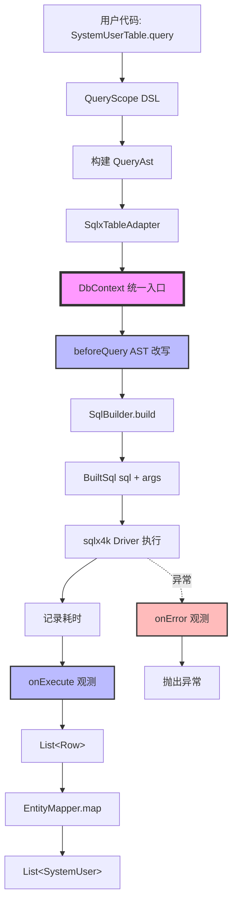
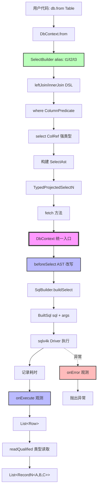
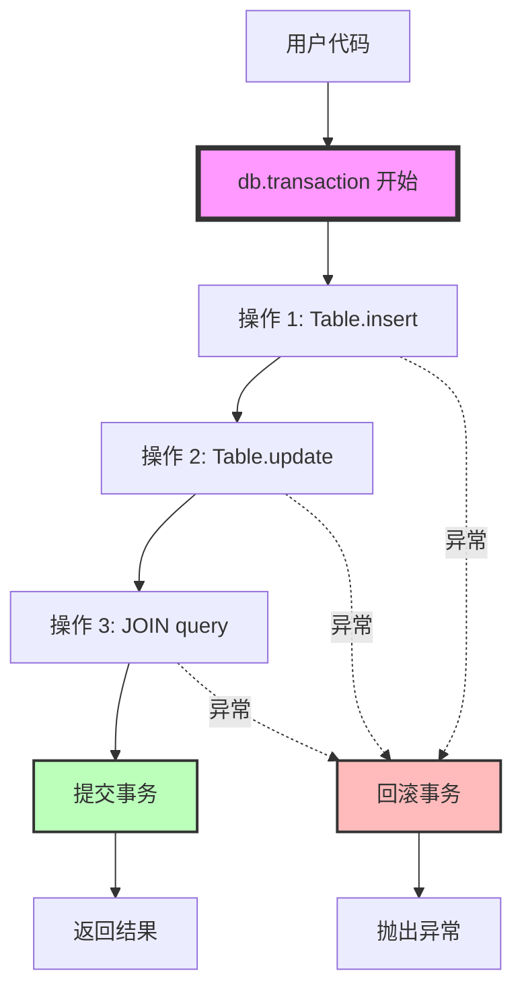

# NetonSQL v2 执行链架构图

> **状态**：冻结文档（C+ 架构）
> **版本**：v2.0
> **更新**：2026-02-20

## 一、总览：统一执行门面

NetonSQL v2 通过 **DbContext 统一执行门面** 实现 Phase 1 和 Phase 4 的执行路径统一。

**核心原则**：
- ✅ 执行统一：所有 SQL 必须经由 DbContext
- ✅ API 稳定：外部 API（如 `Table.query {}`）保持不变
- ✅ 扩展点统一：QueryInterceptor 作为唯一拦截点
- ✅ 事务统一：transaction 作为唯一事务边界

---

## 二、Phase 1 执行链（单表 CRUD）



### 关键节点说明

| 节点 | 职责 | 可扩展性 |
|------|------|----------|
| **QueryAst** | Phase 1 查询 AST（KProperty1 + Predicate） | ✅ 可被 interceptor 改写 |
| **DbContext** | 统一执行门面 | ✅ 唯一拦截链入口 |
| **beforeQuery** | AST 改写（多租户/数据权限注入） | ✅ 可注入 WHERE 条件 |
| **SqlBuilder** | AST → SQL 转换（internal） | ❌ 不可绕过 |
| **onExecute** | 执行观测（日志/metrics/慢 SQL） | ✅ 只读，不修改数据 |
| **EntityMapper** | Row → Entity 映射（KSP 生成） | ❌ 不执行 SQL，仅映射 |

---

## 三、Phase 4 执行链（JOIN 查询）



### 关键节点说明

| 节点 | 职责 | 可扩展性 |
|------|------|----------|
| **SelectBuilder** | JOIN DSL 构建器（auto alias） | ✅ 绑定 DbContext |
| **SelectAst** | Phase 4 JOIN AST（public immutable） | ✅ 可被 interceptor 改写 |
| **DbContext** | 统一执行门面 | ✅ 唯一拦截链入口 |
| **beforeSelect** | AST 改写（多租户/数据权限注入） | ✅ 可注入 WHERE 条件 |
| **SqlBuilder** | AST → SQL 转换（internal） | ❌ 不可绕过 |
| **readQualified** | Row → RecordN 强类型读取 | ❌ 基于 ColumnType enum，无反射 |

---

## 四、拦截链（QueryInterceptor）

```mermaid
flowchart LR
    AST[QueryAst / SelectAst]
    --> I1[Interceptor 1]
    --> I2[Interceptor 2]
    --> IN[Interceptor N]
    --> Build[SqlBuilder.build]
    --> Execute[Driver.execute]
    --> Measure[记录耗时]
    --> O1[Interceptor 1.onExecute]
    --> O2[Interceptor 2.onExecute]
    --> ON[Interceptor N.onExecute]
    --> Result[返回结果]

    Execute -.异常.-> E1[Interceptor 1.onError]
    E1 --> E2[Interceptor 2.onError]
    E2 --> EN[Interceptor N.onError]
    EN --> Throw[抛出异常]

    style I1 fill:#bbf,stroke:#333,stroke-width:2px
    style I2 fill:#bbf,stroke:#333,stroke-width:2px
    style IN fill:#bbf,stroke:#333,stroke-width:2px
    style O1 fill:#bfb,stroke:#333,stroke-width:2px
    style O2 fill:#bfb,stroke:#333,stroke-width:2px
    style ON fill:#bfb,stroke:#333,stroke-width:2px
    style E1 fill:#fbb,stroke:#333,stroke-width:2px
    style E2 fill:#fbb,stroke:#333,stroke-width:2px
    style EN fill:#fbb,stroke:#333,stroke-width:2px
```



### 拦截点职责

| 拦截点 | 时机 | 用途 | 可修改内容 |
|--------|------|------|------------|
| **beforeQuery** | SQL 执行前 | AST 改写 | ✅ 可修改 QueryAst（注入 WHERE） |
| **beforeSelect** | SQL 执行前 | AST 改写 | ✅ 可修改 SelectAst（注入 WHERE） |
| **onExecute** | SQL 执行后 | 观测统计 | ❌ 只读，不可修改结果 |
| **onError** | SQL 异常时 | 错误观测 | ❌ 只读，不可修改异常 |

---

## 五、事务边界



**事务原则**：
- ✅ `DbContext.transaction` 是唯一事务边界
- ✅ 事务内所有操作共享同一连接
- ✅ 异常自动回滚
- ✅ 正常结束自动提交

---

## 六、扩展场景示例

### 6.1 多租户自动注入

```kotlin
class TenantInterceptor(private val tenantId: Long) : QueryInterceptor {
    override fun beforeQuery(ast: QueryAst<*>): QueryAst<*> {
        // 注入 WHERE tenant_id = ?
        val tenantPredicate = Predicate.Eq("tenant_id", tenantId)
        return ast.copy(
            where = ast.where?.let { Predicate.And(it, tenantPredicate) }
                ?: tenantPredicate
        )
    }

    override fun beforeSelect(ast: SelectAst): SelectAst {
        // JOIN 查询同样注入
        val tenantPredicate = ColumnPredicate.Eq("t1", "tenant_id", tenantId)
        return ast.copy(
            where = ast.where?.let { ColumnPredicate.And(it, tenantPredicate) }
                ?: tenantPredicate
        )
    }
}
```

### 6.2 慢 SQL 告警

```kotlin
class SlowQueryInterceptor(private val thresholdMs: Long = 1000) : QueryInterceptor {
    override fun onExecute(sql: String, args: List<Any?>, elapsedMs: Long) {
        if (elapsedMs > thresholdMs) {
            logger.warn("慢 SQL 告警: ${elapsedMs}ms - $sql")
            // 发送告警通知
            alertService.send("SlowQuery", sql, elapsedMs)
        }
    }
}
```

### 6.3 SQL 执行日志

```kotlin
class SqlLogInterceptor : QueryInterceptor {
    override fun onExecute(sql: String, args: List<Any?>, elapsedMs: Long) {
        logger.debug("SQL: $sql | Args: $args | Time: ${elapsedMs}ms")
    }

    override fun onError(sql: String, args: List<Any?>, error: Throwable) {
        logger.error("SQL 执行失败: $sql | Args: $args", error)
    }
}
```

---

## 七、架构保证（冻结）

### 7.1 不可绕过的路径

❌ **禁止**：
- SqlBuilder 直接执行 SQL
- Table / Adapter 直接调用 driver
- 全局单例执行器（SelectExecutor 已删除）
- 在 DSL 之外拼接 SQL 字符串

✅ **唯一路径**：
```
DSL → AST → DbContext → Interceptor → SqlBuilder → Driver
```

### 7.2 扩展点稳定性

所有扩展必须基于：
- **SelectAst**（Phase 4 JOIN AST）
- **QueryAst**（Phase 1 单表 AST）
- **DbContext**（统一执行门面）
- **QueryInterceptor**（唯一拦截点）

### 7.3 未来可演进能力

基于当前架构，未来可无痛扩展：
- ✅ 多租户自动注入
- ✅ 数据权限控制
- ✅ 软删除自动过滤
- ✅ SQL 查询缓存
- ✅ 读写分离路由
- ✅ 多数据源切换
- ✅ 分布式事务（2PC/Saga）
- ✅ SQL 审计日志
- ✅ 慢 SQL 统计
- ✅ Metrics 埋点

---

## 八、对比：C+ vs 其他方案

| 方案 | Phase 1/4 统一 | API 稳定性 | 扩展点 | 事务边界 | 工程风险 |
|------|----------------|------------|--------|----------|----------|
| **B (激进)** | ✅ 统一 | ❌ 破坏性变更 | ✅ 统一 | ✅ 统一 | 🔴 高（大范围重构） |
| **C (纯渐进)** | ❌ 分裂 | ✅ 稳定 | ❌ 分散 | ❌ 分散 | 🟡 中（未来债务） |
| **C+ (本方案)** | ✅ 内部统一 | ✅ 稳定 | ✅ 统一 | ✅ 统一 | 🟢 低（最小闭环） |

**C+ 优势**：
- ✅ 最小工程风险（不推翻 Phase 1）
- ✅ 最大扩展性（统一拦截点）
- ✅ 最佳用户体验（API 不变）
- ✅ 最强架构保证（冻结执行链）

---

## 九、总结

NetonSQL v2 通过 **C+ 统一执行门面** 实现了：

1. **架构统一**：Phase 1 和 Phase 4 都走 DbContext 执行链
2. **API 稳定**：外部 API 保持不变，用户无感知
3. **扩展点统一**：QueryInterceptor 作为唯一拦截点
4. **未来可演进**：多租户/数据权限/慢 SQL 等能力可无痛扩展

**从"SQL DSL 框架"升级为"可扩展数据库内核"。**

🔒 **本架构自 v2.0 起冻结，不可推翻。**
