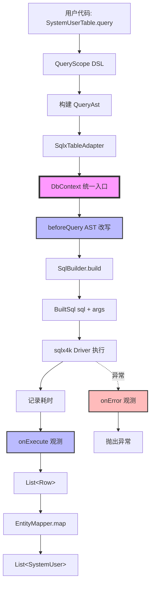
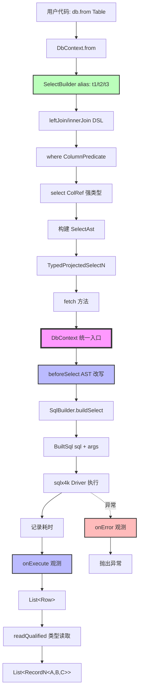
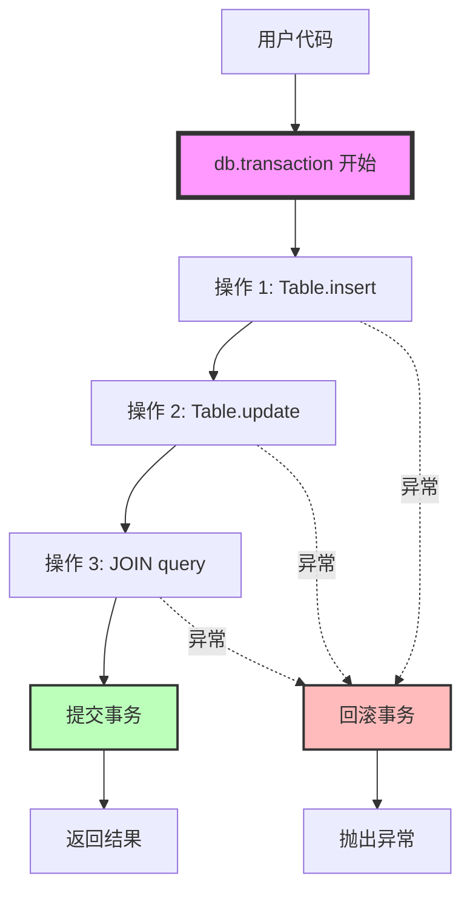

# Neton 数据库执行链与约束规范

> **状态**：冻结文档（C+ 架构）
> **版本**：v1.0
> **更新**：2026-02-20
> **定位**：定义 NetonSQL v1 的统一执行门面（DbContext）、拦截链（QueryInterceptor）、事务边界与架构冻结约束。

---

## 一、总览：统一执行门面

NetonSQL v1 通过 **DbContext 统一执行门面** 实现 Phase 1 和 Phase 4 的执行路径统一。

**核心原则**：
- ✅ 执行统一：所有 SQL 必须经由 DbContext
- ✅ API 稳定：外部 API（如 `Table.query {}`）保持不变
- ✅ 扩展点统一：QueryInterceptor 作为唯一拦截点
- ✅ 事务统一：transaction 作为唯一事务边界

---

## 二、DbContext —— 唯一执行门面（冻结）

**1️⃣ 定位**

DbContext 是 NetonSQL 的统一执行门面（execution gateway）。
- Phase 1（单表 CRUD / QueryAst）
- Phase 4（JOIN / SelectAst）

所有 SQL 执行必须通过 DbContext 进行。

**禁止**：
- SqlBuilder 直接触发数据库执行
- Table / Adapter 直接调用底层 driver
- 全局单例执行器（如 SelectExecutor）

SelectExecutor 在 v1 中彻底移除。
统一执行路径由 DbContext 承担。

---

**2️⃣ 冻结接口定义**

```kotlin
interface DbContext {

    /** 执行查询（Phase 1 + Phase 4 统一入口） */
    suspend fun query(built: BuiltSql): List<Row>

    /** 执行更新（INSERT / UPDATE / DELETE） */
    suspend fun execute(built: BuiltSql): Long

    /** 事务边界 */
    suspend fun <R> transaction(block: suspend DbContext.() -> R): R

    /** Interceptor 链（只读） */
    val interceptors: List<QueryInterceptor>

    /** Phase 4 JOIN 入口 */
    fun <T : Any> from(table: Table<T, *>): Pair<SelectBuilder, TableRef<T>>
}
```

---

**3️⃣ 冻结职责**

DbContext 必须承担以下职责：

| 职责 | 说明 |
|------|------|
| SQL 执行 | 统一调用底层 driver（如 sqlx4k） |
| 事务控制 | transaction 作为唯一事务边界 |
| 拦截链调度 | 在执行前后调用 QueryInterceptor |
| 错误传播 | 统一错误模型 |
| 未来扩展点 | 多租户、数据权限、慢 SQL、Metrics |

---

**4️⃣ 执行流程（冻结四步链路）**

任何查询执行必须遵循以下链路：

1. 构建 AST（QueryAst / SelectAst）
2. 进入 DbContext
3. 触发 Interceptor.beforeXxx(ast)（可改写 AST）
4. SqlBuilder.build(ast) → BuiltSql(sql, args)
5. 调用底层 driver 执行
6. 记录耗时
7. 触发 Interceptor.onExecute / onError
8. 返回 Row 或映射结果

---

**5️⃣ Phase 1 与 Phase 4 的统一要求（冻结）**

| 场景 | 必须行为 |
|------|----------|
| Table.query() | 内部执行必须调用 DbContext.query() |
| SqlxTableAdapter | 不得直接触发 driver |
| ProjectedSelect | 内部必须调用 DbContext.query() |
| TypedProjection | 内部必须调用 DbContext.query() |

**冻结原则**：执行统一，API 稳定。

外部 API（如 `SystemUserTable.query {}`）保持不变，
但内部必须走 DbContext 执行链。

---

## 三、QueryInterceptor —— 冻结扩展点

**1️⃣ 定位**

QueryInterceptor 是 NetonSQL 的唯一 AST 改写与执行观测扩展点。

它用于：
- 多租户注入
- 数据权限注入
- 软删除自动注入
- SQL 执行日志
- 慢 SQL 统计
- Metrics 埋点

---

**2️⃣ 冻结接口定义**

```kotlin
interface QueryInterceptor {

    /** Phase 1 单表查询改写入口 */
    fun beforeQuery(ast: QueryAst<*>): QueryAst<*> = ast

    /** Phase 4 JOIN 查询改写入口 */
    fun beforeSelect(ast: SelectAst): SelectAst = ast

    /** 执行成功后观测（只读，不可修改结果） */
    fun onExecute(sql: String, args: List<Any?>, elapsedMs: Long) {}

    /** 执行异常观测 */
    fun onError(sql: String, args: List<Any?>, error: Throwable) {}
}
```

---

**3️⃣ 明确排除（冻结）**

以下能力 **不属于** v1 设计范围：
- ❌ 不允许 `afterFetch(List&lt;T&gt;)` 这种结果改写钩子
- ❌ 不允许在拦截器中修改返回数据
- ❌ 不允许在拦截器中执行额外 SQL

**设计原则**：
Interceptor 只负责 AST 改写和执行观测，不参与业务逻辑。

---

**4️⃣ 冻结拦截顺序**

执行顺序固定为：

```
beforeQuery / beforeSelect
→ SqlBuilder.build()
→ driver.execute()
→ onExecute / onError
```

拦截器按注册顺序执行。

---

## 四、SelectExecutor 移除声明

v1 中不再存在 SelectExecutor 全局对象。

**原因**：
1. ❌ 不符合 KMP Native 架构（无全局连接上下文）
2. ❌ 无法正确管理事务边界
3. ❌ 无法提供统一拦截链
4. ❌ 阻断未来多租户 / 观测扩展

所有执行必须经由 DbContext。

---

## 五、执行链架构图

### 5.1 Phase 1 执行链（单表 CRUD）



#### 关键节点说明

| 节点 | 职责 | 可扩展性 |
|------|------|----------|
| **QueryAst** | Phase 1 查询 AST（KProperty1 + Predicate） | ✅ 可被 interceptor 改写 |
| **DbContext** | 统一执行门面 | ✅ 唯一拦截链入口 |
| **beforeQuery** | AST 改写（多租户/数据权限注入） | ✅ 可注入 WHERE 条件 |
| **SqlBuilder** | AST → SQL 转换（internal） | ❌ 不可绕过 |
| **onExecute** | 执行观测（日志/metrics/慢 SQL） | ✅ 只读，不修改数据 |
| **EntityMapper** | Row → Entity 映射（KSP 生成） | ❌ 不执行 SQL，仅映射 |

---

### 5.2 Phase 4 执行链（JOIN 查询）



#### 关键节点说明

| 节点 | 职责 | 可扩展性 |
|------|------|----------|
| **SelectBuilder** | JOIN DSL 构建器（auto alias） | ✅ 绑定 DbContext |
| **SelectAst** | Phase 4 JOIN AST（public immutable） | ✅ 可被 interceptor 改写 |
| **DbContext** | 统一执行门面 | ✅ 唯一拦截链入口 |
| **beforeSelect** | AST 改写（多租户/数据权限注入） | ✅ 可注入 WHERE 条件 |
| **SqlBuilder** | AST → SQL 转换（internal） | ❌ 不可绕过 |
| **readQualified** | Row → RecordN 强类型读取 | ❌ 基于 ColumnType enum，无反射 |

---

### 5.3 拦截链（QueryInterceptor）

```mermaid
flowchart LR
    AST[QueryAst / SelectAst]
    --> I1[Interceptor 1]
    --> I2[Interceptor 2]
    --> IN[Interceptor N]
    --> Build[SqlBuilder.build]
    --> Execute[Driver.execute]
    --> Measure[记录耗时]
    --> O1[Interceptor 1.onExecute]
    --> O2[Interceptor 2.onExecute]
    --> ON[Interceptor N.onExecute]
    --> Result[返回结果]

    Execute -.异常.-> E1[Interceptor 1.onError]
    E1 --> E2[Interceptor 2.onError]
    E2 --> EN[Interceptor N.onError]
    EN --> Throw[抛出异常]

    style I1 fill:#bbf,stroke:#333,stroke-width:2px
    style I2 fill:#bbf,stroke:#333,stroke-width:2px
    style IN fill:#bbf,stroke:#333,stroke-width:2px
    style O1 fill:#bfb,stroke:#333,stroke-width:2px
    style O2 fill:#bfb,stroke:#333,stroke-width:2px
    style ON fill:#bfb,stroke:#333,stroke-width:2px
    style E1 fill:#fbb,stroke:#333,stroke-width:2px
    style E2 fill:#fbb,stroke:#333,stroke-width:2px
    style EN fill:#fbb,stroke:#333,stroke-width:2px
```



#### 拦截点职责

| 拦截点 | 时机 | 用途 | 可修改内容 |
|--------|------|------|------------|
| **beforeQuery** | SQL 执行前 | AST 改写 | ✅ 可修改 QueryAst（注入 WHERE） |
| **beforeSelect** | SQL 执行前 | AST 改写 | ✅ 可修改 SelectAst（注入 WHERE） |
| **onExecute** | SQL 执行后 | 观测统计 | ❌ 只读，不可修改结果 |
| **onError** | SQL 异常时 | 错误观测 | ❌ 只读，不可修改异常 |

---

## 六、实现细节

### 6.1 DbContext 新增方法

```kotlin
interface DbContext {
    // Phase 1 保留（raw SQL 逃生口，不变）
    suspend fun fetchAll(sql: String, params: Map<String, Any?> = emptyMap()): List<Row>
    suspend fun fetchOne(sql: String, params: Map<String, Any?> = emptyMap()): Row?
    suspend fun execute(sql: String, params: Map<String, Any?> = emptyMap()): Long

    // Phase 4 新增：JOIN 查询入口（替代原顶层 from 函数，绑定执行上下文）
    fun <T : Any> from(table: Table<T, *>): Pair<SelectBuilder, TableRef<T>>
}

// module-internal：仅供 ProjectedSelect / TypedProjectedSelectN 调用，不对外暴露
internal suspend fun DbContext.selectRows(ast: SelectAst): List<Row>
internal suspend fun DbContext.countRows(ast: SelectAst): Long
```

> **迁移**：原顶层 `fun &lt;T : Any&gt; from(table: Table&lt;T, *&gt;)` 标 `@Deprecated`，迁移为 `db.from(table)`，迁移完成后删除。

### 6.2 SelectBuilder 改造（绑定 DbContext）

```kotlin
class SelectBuilder internal constructor(
    internal val db: DbContext    // ★ 改造：绑定执行上下文，由 DbContext.from() 注入
) {
    // ...（alias 分配、join/where/orderBy/groupBy/limit 等不变）...

    // Row 逃生口（适合 into / intoOrNull / groupOneToMany 自定义映射）
    fun selectRows(vararg cols: ColRef<*, *>): ProjectedSelect =
        ProjectedSelect(db, buildAst(cols.map { ProjectionExpr.Col(it.alias, it.columnName) }))

    fun selectAllRows(): ProjectedSelect = ProjectedSelect(db, buildAst(emptyList()))

    // Phase 4 typed projection（基于 ColRef，与 Phase 3 路径 A 风格对齐）
    fun <A> select(c1: ColRef<*, A>): TypedProjectedSelect1<A>
    fun <A, B> select(c1: ColRef<*, A>, c2: ColRef<*, B>): TypedProjectedSelect2<A, B>
    fun <A, B, C> select(
        c1: ColRef<*, A>, c2: ColRef<*, B>, c3: ColRef<*, C>
    ): TypedProjectedSelect3<A, B, C>
    // ... 到 8 列
}
```

### 6.3 ProjectedSelect（Row 逃生口，绑定 DbContext）

```kotlin
class ProjectedSelect internal constructor(
    private val db: DbContext,
    private val ast: SelectAst
) {
    /** Row 逃生口：适合 intoOrNull / into / groupOneToMany 手动映射 */
    suspend fun fetchRows(): List<Row> = db.selectRows(ast)
    suspend fun count(): Long = db.countRows(ast)
    suspend fun pageRows(page: Int, size: Int): Page<Row> {
        val total = count()
        val items = db.selectRows(ast.copy(limit = size, offset = (page - 1) * size))
        return Page(items, total, page, size)
    }
}
```

### 6.4 TypedProjectedSelect（Phase 4 JOIN 强类型投影，以 Rec2 为例，其余 N 形态一致）

```kotlin
class TypedProjectedSelect2<A, B> internal constructor(
    private val db: DbContext,
    private val ast: SelectAst,
    private val read1: (Row) -> A,   // 编译期由 ColRef 类型确定，不依赖运行时反射
    private val read2: (Row) -> B
) {
    suspend fun fetch(): List<Record2<A, B>> =
        db.selectRows(ast).map { Record2(read1(it), read2(it)) }
    suspend fun count(): Long = db.countRows(ast)
    suspend fun page(page: Int, size: Int): Page<Record2<A, B>> {
        val total = count()
        val items = db.selectRows(ast.copy(limit = size, offset = (page - 1) * size))
                      .map { Record2(read1(it), read2(it)) }
        return Page(items, total, page, size)
    }
}
```

`SelectBuilder.select()` 在构建期绑定读取器（以 2 列为例）：

```kotlin
fun <A, B> select(c1: ColRef<*, A>, c2: ColRef<*, B>): TypedProjectedSelect2<A, B> {
    val key1 = "${c1.alias}_${c1.columnName}"
    val key2 = "${c2.alias}_${c2.columnName}"
    return TypedProjectedSelect2(
        db  = db,
        ast = buildAst(listOf(
            ProjectionExpr.Col(c1.alias, c1.columnName),
            ProjectionExpr.Col(c2.alias, c2.columnName)
        )),
        read1 = { row -> row.readQualified(key1, c1.column) },
        read2 = { row -> row.readQualified(key2, c2.column) }
    )
}
```

`readQualified` 见附录 A §A.5。

### 6.5 两条投影路径（冻结）

| 路径 | 场景 | DSL | 返回类型 |
|------|------|-----|----------|
| **路径 A**（Phase 3） | 单表 typed projection | `EntityQuery.select(T::a, T::b)` | `List&lt;Record2&lt;A, B&gt;&gt;` |
| **路径 B**（Phase 4） | JOIN typed projection | `q.select(U.id, R.name)` | `List&lt;Record2&lt;A, B&gt;&gt;` |
| **逃生口** | JOIN + 自定义映射 | `q.selectRows(...).fetchRows()` | `List&lt;Row&gt;` |

**说明**：Phase 4 JOIN 投影不退化为 `Row`。路径 B 是正式路径；`fetchRows()` / `pageRows()` 是逃生口，适合 `groupOneToMany` 等手动映射场景。

---

## 七、拦截器执行顺序（冻结）

**冻结规则**：拦截器按注册顺序执行，且 AST 改写采用链式传递（fold）。

**A) beforeQuery / beforeSelect（AST rewrite）**

- DbContext 在执行 SQL 之前，必须按 `interceptors` 的顺序依次调用拦截器的 `beforeQuery` / `beforeSelect`。
- 每个拦截器的返回值，作为下一个拦截器的输入（链式传递）。
- 最终得到的 `finalAst` 才允许进入 SqlBuilder 生成 SQL。

**冻结伪代码**：

```kotlin
val finalAst = interceptors.fold(ast) { current, it ->
    it.beforeSelect(current)
}
```

`beforeQuery`（Phase 1 单表）同理。

**B) onExecute / onError（执行观测）**

- DbContext 在完成 SQL 构建并执行之后，必须按注册顺序调用：
  - `onExecute(sql, args, elapsedMs)`（成功路径）
  - `onError(sql, args, error)`（失败路径）
- `onExecute/onError` 只允许观测，不允许改写 SQL、args、结果集或抛出异常影响主流程（可记录自身错误，但不得中断查询）。

**冻结伪代码**：

```kotlin
for (it in interceptors) it.onExecute(sql, args, elapsedMs)
// 或失败：for (it in interceptors) it.onError(sql, args, error)
```

**C) 幂等性要求（强约束）**

每个拦截器的 AST 改写必须满足幂等：
- `f(f(ast)) == f(ast)`

用于避免多租户/数据权限/软删等注入条件在多次执行（或重试、分页 count+select）时重复叠加导致 SQL 膨胀或语义错误。

**推荐策略**（非强制实现细节）：
- 在 AST 上用固定结构表示注入条件（例如统一附加到 where 的 And(children) 中）
- 或在注入前检测 AST 是否已包含相同条件（基于结构相等）

---

## 八、AST 不可变性保证（冻结）

**冻结规则**：QueryAst / SelectAst 永远保持不可变结构，禁止为了性能将其改成 mutable。

**A) 不可变承诺**

- QueryAst / SelectAst 必须使用不可变数据结构表达（推荐：`data class` + `val` 字段）。
- 改写必须通过 `copy()` 返回新对象，禁止原地修改。

**B) 防御性拷贝（冻结）**

任何可能来自外部可变集合的字段，在 AST 构建完成时必须做防御性拷贝：
- `List` / `Map` / `Set` 等统一 `toList()` / `toMap()` / `toSet()` 进入 AST。
- AST 对外暴露后应视为只读快照。

**C) 兼容性声明**

- v1 保证：AST 结构与字段语义不会在 minor 版本中发生破坏性变更（新增字段允许，但不得改变现有字段含义）。
- 未来如需扩展（CTE/subquery/window），只能以"新增 AST 节点/字段"的方式演进，不得推翻 v1 结构。

---

## 九、DbContext 职责边界（冻结）

**冻结规则**：DbContext 是"统一执行门面"（内部基础设施），只负责执行与观测调度，不承载业务策略。

**A) DbContext 必须承担的职责（冻结）**

DbContext 的职责边界固定为：

1. **SQL 执行**
   - `query(BuiltSql): List&lt;Row&gt;`
   - `execute(BuiltSql): Long`

2. **事务边界**
   - `transaction { }`（在 driver 支持后落地；v1 可允许 TODO，但接口语义冻结）

3. **拦截链调度**
   - 调用 `QueryInterceptor.beforeQuery/beforeSelect`（AST rewrite）
   - 调用 `QueryInterceptor.onExecute/onError`（观测）

4. **JOIN 入口**
   - `from(table)` 构建 SelectBuilder / TableRef（不要求对外暴露更多 TableOps API）

**B) 禁止内置业务策略（冻结）**

DbContext（含 SqlxDbContext 实现类）禁止直接实现以下能力：
- ❌ SQL cache / query result cache
- ❌ 多租户注入逻辑（tenant_id 条件）
- ❌ 数据权限注入逻辑（org_id / dept scope）
- ❌ 软删除注入逻辑（deleted / deleted_at 条件）
- ❌ Metrics/Tracing/SlowSQL 的具体策略
- ❌ 自定义重试、熔断等策略

上述能力必须通过 `QueryInterceptor` 扩展实现，保证 DbContext 的长期可控性，避免演变为 God Object。

**C) Phase 1 / Phase 4 执行统一（冻结）**

- Phase 1（单表 QueryAst）与 Phase 4（JOIN SelectAst）在实际执行时，必须都通过 DbContext 的统一执行入口完成：
  - AST rewrite → SqlBuilder → BuiltSql → DbContext.query/execute → onExecute/onError
- 对外 API 保持稳定，不强推用户改写为 `DbContext.table()/TableOps` 等新 API。

---

## 十、事务边界



**事务原则**：
- ✅ `DbContext.transaction` 是唯一事务边界
- ✅ 事务内所有操作共享同一连接
- ✅ 异常自动回滚
- ✅ 正常结束自动提交

---

## 十一、扩展场景示例

### 11.1 多租户自动注入

```kotlin
class TenantInterceptor(private val tenantId: Long) : QueryInterceptor {
    override fun beforeQuery(ast: QueryAst<*>): QueryAst<*> {
        // 注入 WHERE tenant_id = ?
        val tenantPredicate = Predicate.Eq("tenant_id", tenantId)
        return ast.copy(
            where = ast.where?.let { Predicate.And(it, tenantPredicate) }
                ?: tenantPredicate
        )
    }

    override fun beforeSelect(ast: SelectAst): SelectAst {
        // JOIN 查询同样注入
        val tenantPredicate = ColumnPredicate.Eq("t1", "tenant_id", tenantId)
        return ast.copy(
            where = ast.where?.let { ColumnPredicate.And(it, tenantPredicate) }
                ?: tenantPredicate
        )
    }
}
```

### 11.2 慢 SQL 告警

```kotlin
class SlowQueryInterceptor(private val thresholdMs: Long = 1000) : QueryInterceptor {
    override fun onExecute(sql: String, args: List<Any?>, elapsedMs: Long) {
        if (elapsedMs > thresholdMs) {
            logger.warn("慢 SQL 告警: ${elapsedMs}ms - $sql")
            // 发送告警通知
            alertService.send("SlowQuery", sql, elapsedMs)
        }
    }
}
```

### 11.3 SQL 执行日志

```kotlin
class SqlLogInterceptor : QueryInterceptor {
    override fun onExecute(sql: String, args: List<Any?>, elapsedMs: Long) {
        logger.debug("SQL: $sql | Args: $args | Time: ${elapsedMs}ms")
    }

    override fun onError(sql: String, args: List<Any?>, error: Throwable) {
        logger.error("SQL 执行失败: $sql | Args: $args", error)
    }
}
```

---

## 十二、架构保证（冻结）

### 12.1 不可绕过的路径

❌ **禁止**：
- SqlBuilder 直接执行 SQL
- Table / Adapter 直接调用 driver
- 全局单例执行器（SelectExecutor 已删除）
- 在 DSL 之外拼接 SQL 字符串

✅ **唯一路径**：
```
DSL → AST → DbContext → Interceptor → SqlBuilder → Driver
```

### 12.2 扩展点稳定性

所有扩展必须基于：
- **SelectAst**（Phase 4 JOIN AST）
- **QueryAst**（Phase 1 单表 AST）
- **DbContext**（统一执行门面）
- **QueryInterceptor**（唯一拦截点）

### 12.3 未来可演进能力

基于当前架构，未来可无痛扩展：
- ✅ 多租户自动注入
- ✅ 数据权限控制
- ✅ 软删除自动过滤
- ✅ SQL 查询缓存
- ✅ 读写分离路由
- ✅ 多数据源切换
- ✅ 分布式事务（2PC/Saga）
- ✅ SQL 审计日志
- ✅ 慢 SQL 统计
- ✅ Metrics 埋点

---

## 十三、对比：C+ vs 其他方案

| 方案 | Phase 1/4 统一 | API 稳定性 | 扩展点 | 事务边界 | 工程风险 |
|------|----------------|------------|--------|----------|----------|
| **B (激进)** | ✅ 统一 | ❌ 破坏性变更 | ✅ 统一 | ✅ 统一 | 🔴 高（大范围重构） |
| **C (纯渐进)** | ❌ 分裂 | ✅ 稳定 | ❌ 分散 | ❌ 分散 | 🟡 中（未来债务） |
| **C+ (本方案)** | ✅ 内部统一 | ✅ 稳定 | ✅ 统一 | ✅ 统一 | 🟢 低（最小闭环） |

**C+ 优势**：
- ✅ 最小工程风险（不推翻 Phase 1）
- ✅ 最大扩展性（统一拦截点）
- ✅ 最佳用户体验（API 不变）
- ✅ 最强架构保证（冻结执行链）

---

## 十四、架构稳定性声明

此执行模型保证：
- Phase 1 与 Phase 4 执行路径统一
- 事务边界统一
- 扩展点统一
- 未来能力（多租户 / 数据权限 / SQL cache）可在 AST 层扩展
- 不需要推翻现有 API

---

## 十五、C+ 冻结结论

| 项目 | 状态 |
|------|------|
| Table API | 保持稳定 |
| DbContext | 统一执行门面 |
| QueryInterceptor | 冻结扩展接口 |
| SelectExecutor | 删除 |
| 未来扩展 | 可持续 |

NetonSQL v1 通过 **C+ 统一执行门面** 实现了：

1. **架构统一**：Phase 1 和 Phase 4 都走 DbContext 执行链
2. **API 稳定**：外部 API 保持不变，用户无感知
3. **扩展点统一**：QueryInterceptor 作为唯一拦截点
4. **未来可演进**：多租户/数据权限/慢 SQL 等能力可无痛扩展

**从"SQL DSL 框架"升级为"可扩展数据库内核"。**

---

**🔒 冻结声明**

NetonSQL v1 执行链模型自本版本起冻结。
- 不允许新增绕过 DbContext 的执行路径
- 不允许新增全局 SQL 执行单例
- 不允许在 DSL 之外拼接 SQL

所有扩展必须基于：
- SelectAst
- QueryAst
- DbContext
- QueryInterceptor

🔒 **本架构自 v1.0 起冻结，不可推翻。**
